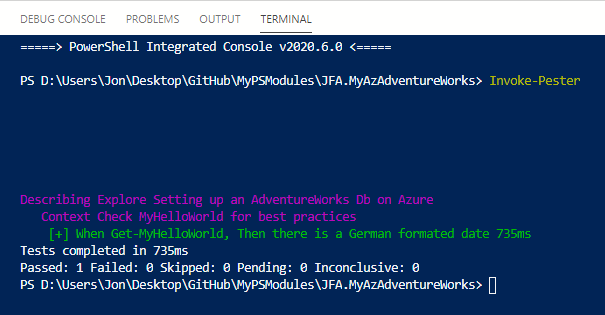

# JFA.MyAzAdventureWorks README.md #

TLDR: To setup AdventureWorks on Azure with a single powershell call

## TOC ##

+ [To Test](#To-Test)
+ [Suggestions](#Suggestions)
+ [Credits/Links](#CreditsLinks)

## To Test ##

1. I cloned my MyPSModules github repo to a folder on my desktop  
    `D:\Users\Jon\Desktop\GitHub\MyPSModules`
2. Using explorer, go into the `JFA.MyAzAdventureWorks` folder and open `D:\Users\Jon\Desktop\GitHub\MyPSModules\JFA.MyAzAdventureWorks\JFA.MyAzAdventureWorks.code-workspace`  
    + This should open the powershell terminal at `D:\Users\Jon\Desktop\GitHub\MyPSModules\JFA.MyAzAdventureWorks>`
3. Run the tests!
    ```powershell
    cd D:\Users\Jon\Desktop\GitHub\MyPSModules\JFA.MyAzAdventureWorks
    Invoke-Pester
    ```
4. The results should look something like this:  
    
    + I think the big gap is due the the way I am importing the module

## Suggestions ##

Because this is still in development, I didn't add the final to a `$ENV:PSModulePath`.

Instead, I added this to my `$Profile.CurrentUserAllHosts` file:
 
```powershell
Import-Module D:\Users\Jon\Desktop\GitHub\MyPSModules\JFA.MyAzAdventureWorks\JFA.MyAzAdventureWorks
```

## Credits/Links ##

PowerShell Explained with Kevin Marquette
+ [Building a Module, one microstep at a time](https://powershellexplained.com/2017-05-27-Powershell-module-building-basics/)

Github comments
+ [Markdown Links](https://gist.github.com/asabaylus/3071099#gistcomment-1593627)

Powershell from MS
+ [Approved Verbs for PowerShell Commands](https://docs.microsoft.com/en-us/powershell/scripting/developer/cmdlet/approved-verbs-for-windows-powershell-commands?view=powershell-7)
+ [Parameters](https://docs.microsoft.com/en-us/powershell/module/microsoft.powershell.core/about/about_functions_advanced_parameters?view=powershell-7)

PoshCode.GitBooks
+ [Functions and Best practices](https://poshcode.gitbooks.io/powershell-practice-and-style/Style-Guide/Function-Structure.html)

DevBlogs.MS
+ [Format DateTime](https://devblogs.microsoft.com/scripting/use-culture-information-in-powershell-to-format-dates/)

AdventureWorks from MS
+ [Sql Samples for Azure on Docs](https://docs.microsoft.com/en-us/sql/samples/adventureworks-install-configure?view=sql-server-ver15#install-to-azure-sql-database)
+ [Github Sql Samples](https://github.com/microsoft/sql-server-samples/tree/master/samples/databases/adventure-works)

_Cheers!_